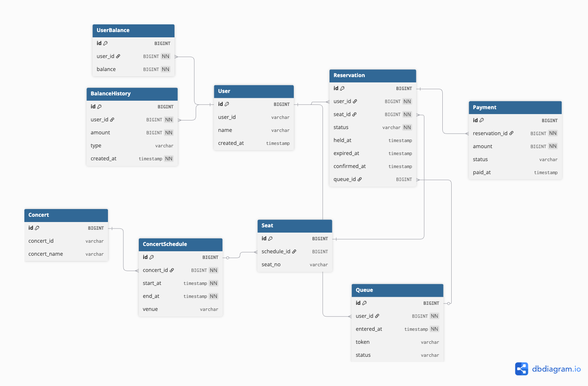

# 콘서트 예약 시스템

## ERD



총 8개 테이블로 구성된 콘서트 예약 플랫폼입니다.

### 사용자 도메인

| 테이블 | 역할 |
|--------|------|
| User | 핵심 사용자 정보 (userId, email, password, name) |
| UserBalance | User와 1:1 관계. 현재 잔액 보관 |
| BalanceHistory | 잔액 변동 이력 (CHARGE / USE / REFUND) |

### 콘서트 도메인

| 테이블 | 역할 |
|--------|------|
| Concert | 콘서트 기본 정보 (이름) |
| ConcertSchedule | 콘서트별 회차 정보 (start_at, end_at, venue). Concert와 1:N |
| Seat | 회차별 좌석 (seat_no). ConcertSchedule과 1:N. (scheduleId, seatNo) 복합 unique |

### 예약/결제 도메인

| 테이블 | 역할 |
|--------|------|
| Queue | 대기열. 상태: `TEMP` → `CONFIRMED` → `CANCELED`/`EXPIRED` |
| Reservation | 좌석 예약. 상태: `HELD` → `CONFIRMED` / `EXPIRED`. User, Seat, Queue를 참조 |
| Payment | Reservation과 1:1. 상태: `PENDING` → `SUCCESS` / `FAILED` / `REFUNDED` |

## DB 설계

### User
| 컬럼 | 타입 | 제약 | 설명 |
|------|------|------|------|
| id | BIGINT | PK | 내부 식별자 |
| user_id | VARCHAR | UNIQUE | 외부 식별자 |
| name | VARCHAR | | 사용자 이름 |
| created_at | TIMESTAMP | | 가입일 |

### Concert
| 컬럼 | 타입 | 제약 | 설명 |
|------|------|------|------|
| id | BIGINT | PK | 내부 식별자 |
| concert_id | VARCHAR | UNIQUE | 외부 식별자 |
| concert_name | VARCHAR | | 콘서트명 |

### ConcertSchedule
| 컬럼 | 타입 | 제약 | 설명 |
|------|------|------|------|
| id | BIGINT | PK | 내부 식별자 |
| concert_id | BIGINT | FK → Concert.id, NOT NULL | 어떤 콘서트의 회차인지 |
| start_at | TIMESTAMP | NOT NULL | 공연 시작일시 |
| end_at | TIMESTAMP | NOT NULL | 공연 종료일시 |
| venue | VARCHAR | | 공연 장소 |

### Seat
| 컬럼 | 타입 | 제약 | 설명 |
|------|------|------|------|
| id | BIGINT | PK | 내부 식별자 |
| schedule_id | BIGINT | FK → ConcertSchedule.id | 해당 공연 회차 |
| seat_no | VARCHAR | | 좌석 번호 (예: A-01) |

### Queue (대기열)
| 컬럼 | 타입 | 제약 | 설명 |
|------|------|------|------|
| id | BIGINT | PK | 내부 식별자 |
| user_id | BIGINT | FK → User.id, NOT NULL | 대기 사용자 |
| entered_at | TIMESTAMP | NOT NULL | 대기열 진입 시각 |
| token | VARCHAR | UNIQUE | 인증 토큰 |
| status | VARCHAR | | `TEMP` / `CONFIRMED` / `CANCELED` / `EXPIRED` |

### Reservation (예약)
| 컬럼 | 타입 | 제약 | 설명 |
|------|------|------|------|
| id | BIGINT | PK | 내부 식별자 |
| user_id | BIGINT | FK → User.id, NOT NULL | 예약 사용자 |
| seat_id | BIGINT | FK → Seat.id, NOT NULL | 예약 좌석 |
| status | VARCHAR | NOT NULL | `HELD` / `CONFIRMED` / `EXPIRED` |
| held_at | TIMESTAMP | | 임시 배정 시각 |
| expired_at | TIMESTAMP | | 만료 예정 시각 |
| confirmed_at | TIMESTAMP | | 예약 확정 시각 |
| queue_id | BIGINT | FK → Queue.id | 연결된 대기열 |

### Payment (결제)
| 컬럼 | 타입 | 제약 | 설명 |
|------|------|------|------|
| id | BIGINT | PK | 내부 식별자 |
| reservation_id | BIGINT | FK → Reservation.id, NOT NULL | 연결된 예약 |
| amount | BIGINT | NOT NULL | 결제 금액 |
| status | VARCHAR | | `PENDING` / `SUCCESS` / `FAILED` / `REFUNDED` |
| paid_at | TIMESTAMP | | 결제 완료 시각 |

### UserBalance (잔액)
| 컬럼 | 타입 | 제약 | 설명 |
|------|------|------|------|
| id | BIGINT | PK | 내부 식별자 |
| user_id | BIGINT | FK → User.id, UNIQUE, NOT NULL | 사용자 |
| balance | BIGINT | NOT NULL, DEFAULT 0 | 현재 잔액 |

### BalanceHistory (잔액 이력)
| 컬럼 | 타입 | 제약 | 설명 |
|------|------|------|------|
| id | BIGINT | PK | 내부 식별자 |
| user_id | BIGINT | FK → User.id, NOT NULL | 사용자 |
| amount | BIGINT | NOT NULL | 충전/차감 금액 |
| type | VARCHAR | | `CHARGE` / `USE` / `REFUND` |
| created_at | TIMESTAMP | NOT NULL | 생성일 |

## 테이블 관계 흐름

```
User ─── UserBalance      (1:1)
     ─── BalanceHistory   (1:N)
     ─── Queue            (1:N)
     ─── Reservation      (1:N)

Concert ─── ConcertSchedule (1:N)
                └─── Seat   (1:N)
                       └─── Reservation (1:N)

Queue       ─── Reservation (1:N)
Reservation ─── Payment     (1:1)
```

### 예약 흐름

```
User
  └── Queue (대기열 진입)
        └── Reservation 생성 허가 (queue_id FK)
              └── Reservation
                    ├── user_id FK  → User
                    └── seat_id FK  → Seat
                                         └── ConcertSchedule
                                               └── Concert
```

## 핵심 설계 포인트

1. **대기열(Queue)** 이 예약과 연결되어, 토큰 기반으로 예약 권한을 제어한다.
2. **잔액은 UserBalance에 현재값**, BalanceHistory에 변동 이력을 분리 저장 — 정합성과 추적성 모두 확보.
3. **좌석(Seat)** 은 콘서트가 아닌 **회차(ConcertSchedule)** 에 귀속 — 회차별로 독립적인 좌석 관리가 가능하다.
4. **Reservation의 `HELD` 상태** 는 임시 점유를 나타내며, 결제 전 만료(EXPIRED) 처리가 스케줄러에서 이루어진다.
